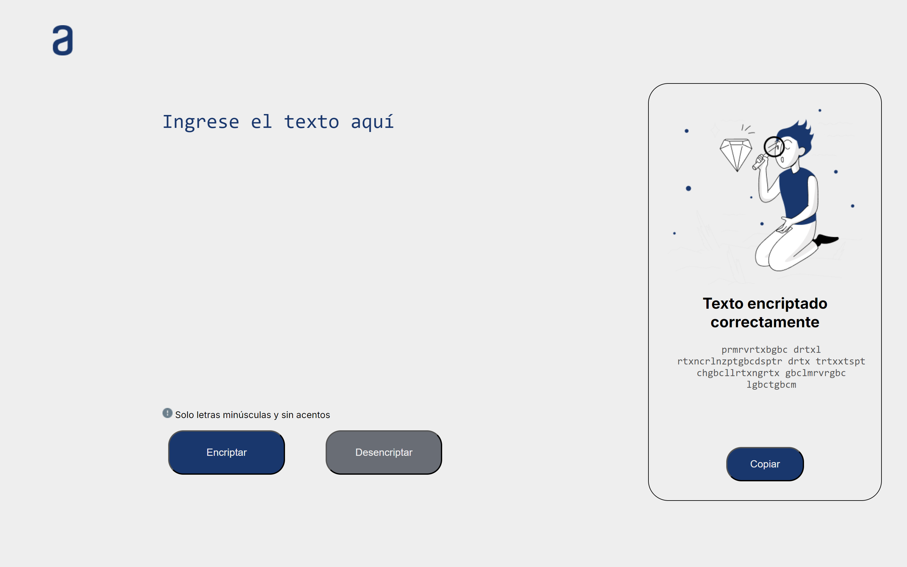
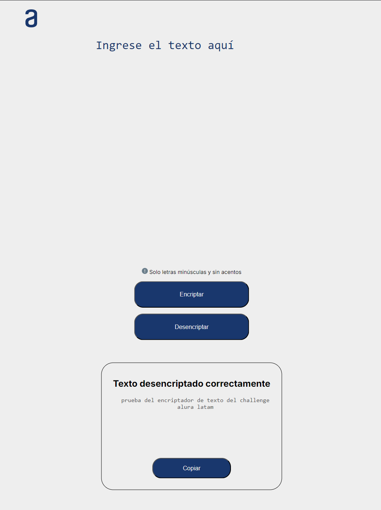
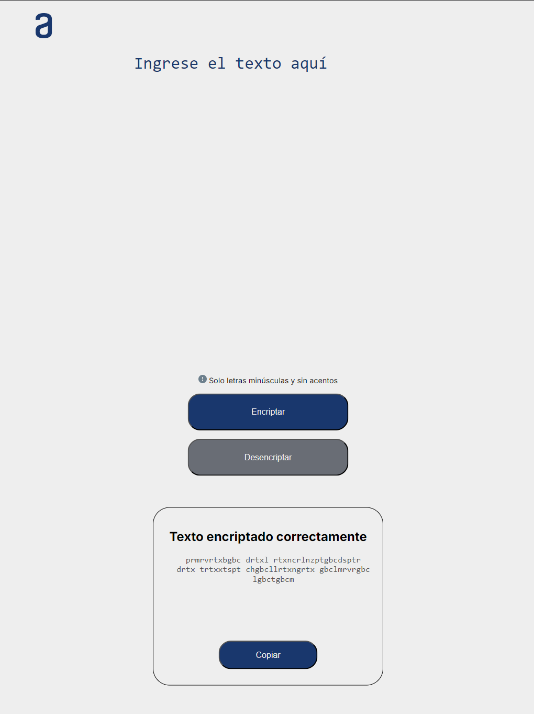
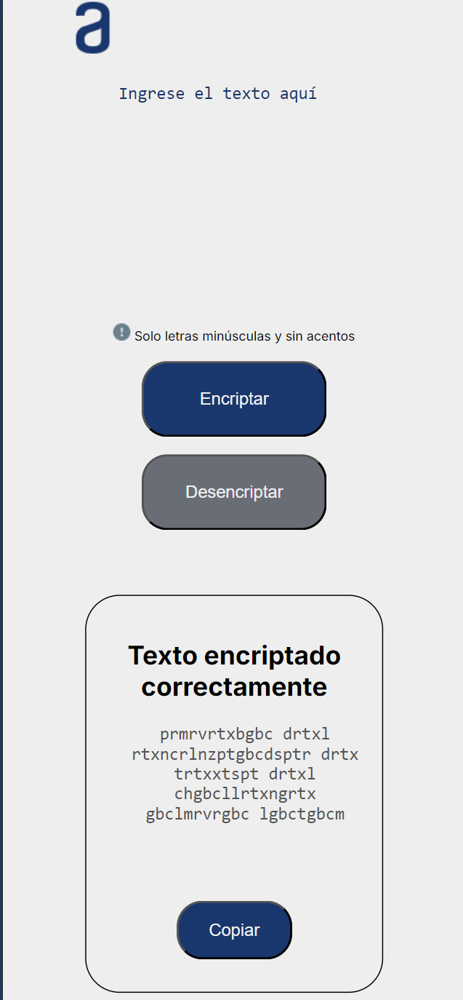
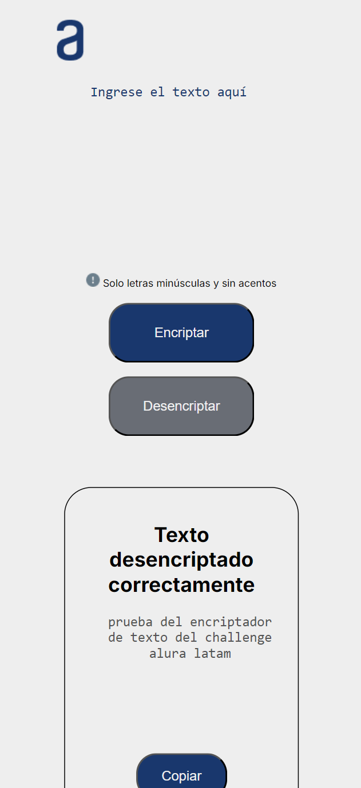
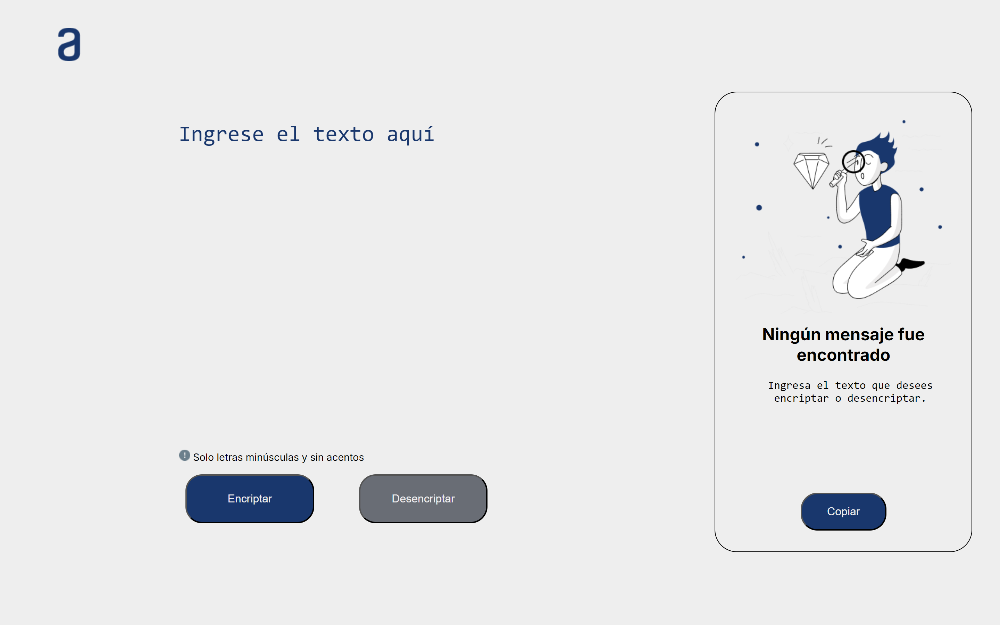

# <h1 align="center"> Challenge Encriptador de Texto</h1> #
Este proyecto es la ultima etapa del curso de programacion del [Programa One-Oracle](https://www.oracle.com/co/education/oracle-next-education/).

Este curso se llevo en la plataforma [Alura LATAM](https://www.aluracursos.com/) donde en diferentes etapas propusieron realizar diferentes tareas de programación para finalizar con un encriptador de texto que tenga las siguientes caracteristicas:

---

## Caracteristicas

1. **Debe permitir encriptar y desencriptar los mensajes proporcionados siguiendo las siguiente llave de encriptacion:**

    * La letra "e" es convertida para "enter"
    * La letra "i" es convertida para "imes"
    * La letra "a" es convertida para "ai"
    * La letra "o" es convertida para "ober"
    * La letra "u" es convertida para "ufat"

***En esta parte decidi cambiar la conversion de las letras por otras para darle un toque diferente. Dando como resultado el siguiente:***

    * La letra "e" es convertida para "rtx"
    * La letra "i" es convertida para "lnz"
    * La letra "a" es convertida para "gbc"
    * La letra "o" es convertida para "spt"
    * La letra "u" es convertida para "mrv"

1. ***(Importante)*** **No debe permitir letras en mayusculas ni acentos ni caracteres especiales.**

1. **Boton de copiar resultado encriptado o desencriptado.**

## Capturas del resultado

* **Muestra del favicon de la pagina** *(Desde el navegador de OperaGX):*

---

* **Muestra de la version de escritorio de la pagina:**

---

* **Muestra de la version de tablet de la pagina:**

---

* **Muestra de la version de celular de la pagina:**

---

* **Muestra de la pagina sin ingresar textos** *(Versión de escritorio):*

---
